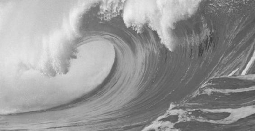
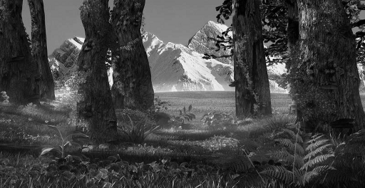
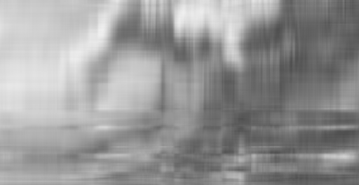
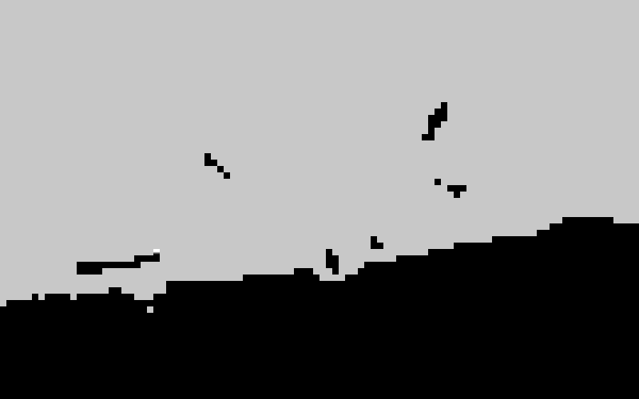
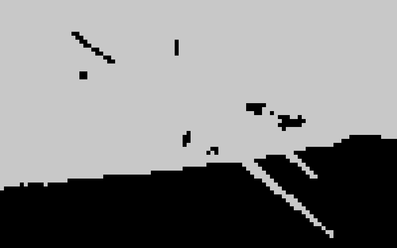
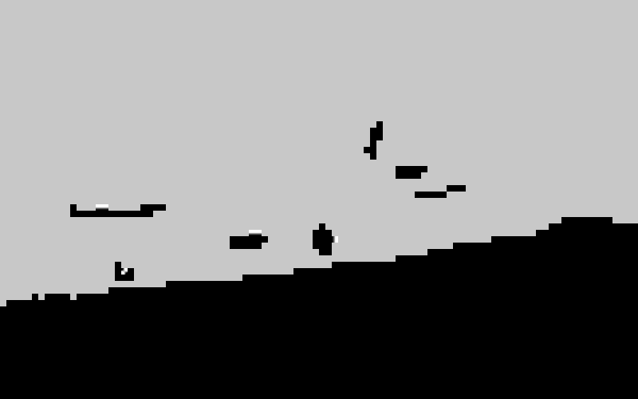

# Data Mining Projects

- Author: LIN JIANING

- Date: 2018.5

- Course: Data Mining 

- Hardware: Laptop

- Language: MATLAB

- IDE: MATLAB

- Description: In the project, I finished 8 tasks and implement Histogram/CCV/PCA/DCT for image analysis. Project Code is in the `Code` folder. 

- Results(incomplete, complete result is in `Report.pdf` but the analysis of the result is in Chinese):

  - PCA

  |    name    |                      I1                      |                      I2                      |                      I3                      |
  | :--------: | :------------------------------------------: | :------------------------------------------: | :------------------------------------------: |
  |   origin   |                        |                        |                        |
  |   **1**    |                                              |                                              |                                              |
  |  reduced   |    |    |    |
  | threshold  |                     0.8                      |                     0.8                      |                     0.8                      |
  | dim(ratio) |                 6  (0.8003)                  |                 2  (0.8933)                  |                 17  (0.8007)                 |
  |   **2**    |                                              |                                              |                                              |
  |  reduced   |    |    |    |
  | threshold  |                     0.9                      |                     0.9                      |                     0.9                      |
  | dim(ratio) |                 14  (0.9046)                 |                 3  (0.9264)                  |                 44  (0.9010)                 |
  |   **3**    |                                              |                                              |                                              |
  |  reduced   |  |  |  |
  | threshold  |                     0.95                     |                     0.95                     |                     0.95                     |
  | dim(ratio) |                 26  (0.9522)                 |                 4  (0.9536)                  |                 80  (0.9509)                 |
  |   **4**    |                                              |                                              |                                              |
  |  reduced   |        |        |        |
  | threshold  |                      1                       |                      1                       |                      1                       |
  | dim(ratio) |                   264  (1)                   |                   264  (1)                   |                   264  (1)                   |

  - DCT

  | Quality Factor (Q) |                     I4                     |                     I5                     |                     I6                     |
  | :----------------: | :----------------------------------------: | :----------------------------------------: | :----------------------------------------: |
  |        0.1         |  |  |  |
  |         1          |      |      |      |
  |         10         |    |    |    |
  |        100         |   |  |  |
