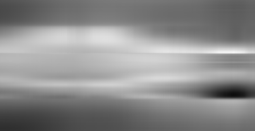
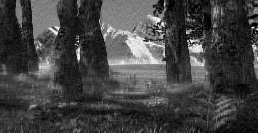
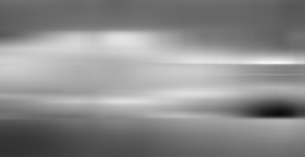
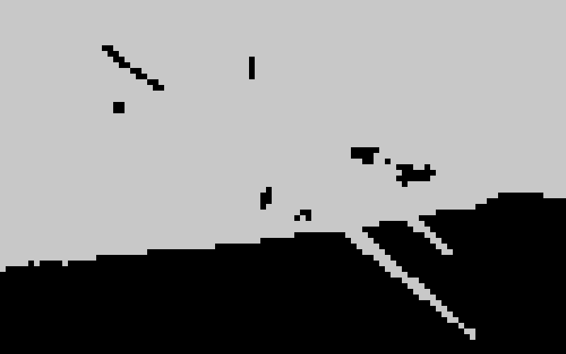

## 数据挖掘大作业 (LIN JIANING)

### Task1

##### Write a function that takes an image (as a matrix) and returns a histogram for this image. The function takes a parameter as the histogram bucket size (10 pts.) 实现一个求解图像直方图的函数，输入为图像（矩阵）以及直方图每个类的大小。

#### 直方图的定义

直方图(Histogram)又称质量分布图。是一种统计报告图，由一系列高度不等的纵向条纹或线段表示数据分布的情况。 一般用横轴表示数据类型，纵轴表示分布情况。直方图是数值数据分布的精确图形表示。这是一个连续变量（定量变量）的概率分布的估计，并且被卡尔·皮尔逊（Karl Pearson）首先引入。它是一种条形图。 为了构建直方图，第一步是将值的范围分段，即将整个值的范围分成一系列间隔，然后计算每个间隔中有多少值。 这些值通常被指定为连续的，不重叠的变量间隔。 间隔必须相邻，并且通常是（但不是必须的）相等的大小。（来源：百度百科）

#### 利用MATLAB实现求解直方图的函数

```matlab
function hist_out = myhist(image_in, width)
%Created by Bill Lin 2018/6
%Input: 
%       image_in (the input image which is gray)
%       width    (the histogram bucket size)
%Output:
%       hist_out (histogram vector)
%
[row, col] = size(image_in);
divide = ceil(256.0 / width);
hist_out = zeros(divide,1);
for i = 1:row
    for j = 1:col
        index = ceil(double((image_in(i,j) + 1.0)) / width);
        hist_out(index) = hist_out(index) + 1;
    end
end
```

### Task2

##### Apply this function to each of the three images given, respectively, using different bucket sizes and report and analyze your observations (10 pts.) 将求解直方图的函数应用于提供的三张图片(I1, I2, I3)，并改变直方图每个类的大小，分析直方图结果。

#### MATLAB主函数

```matlab
clear all
for i = 1:3
    wid = 5;
    I = imread(['./I',num2str(i),'.bmp']);
    [row, col] = size(I);
    histo = myhist(I,wid);
    x=1:wid:256;
    bar(x,histo);axis([0,255,0,1.1*max(histo)]);
    saveas(gcf,['./hist_I',num2str(i),'_',num2str(wid)],'png');
end
```

#### 直方图实验结果

<center> histogram with different bucket sizes </center>

| Bucket Size |                              I1                              |                              I2                              |                              I3                              |
| :---------: | :----------------------------------------------------------: | :----------------------------------------------------------: | :----------------------------------------------------------: |
|      1      |  |  |  |
|      5      |  |  |  |
|     20      |  |  |  |
|     40      |  |  |  |

<center>origin images</center>

|  |  |  |
| :----------------------------------------------------------: | :----------------------------------------------------------: | :----------------------------------------------------------: |
|                              I1                              |                              I2                              |                              I3                              |

#### 结果分析

首先，从直观上来看三张原始图片，第一、二两张图片的色调比较相近，都偏中间灰度，而第三张图片的整体色调明显偏暗，所以直观上分析直方图的分布应该会和第一、二张图有很大不同，果然，我们观察到当直方图的步长选为1的时候，第一、二两张图的大部分像素点落在中间灰度值处，而第三张图整体的灰度值偏低，即更暗一些。其次，由于输入图片是8位256级灰度图片，所以当步长设置为1时，总的直方图类数为256个，是在当前输入下最为细腻的直方图，可以反映一些非常细微的灰度分布变化。随着直方图步长（间距）变大，直方图逐渐丢失一些灰度级之间的细节，统计变得更加粗略，特征减少。

### Task3

##### We all know that histograms are a method for data reduction, and in this study we use one-dimensional histograms to represent two-dimensional images. How effective are histograms used to represent images of the same object but under rotations in three-dimensional space or under a partial occlusion as shown in images I4, I5, and I6 in the same project package? (10 pts.) 当直方图被用于代表那些在空间有旋转或者有一部分被遮挡的同一物体,比如数据中的I4、I5、I6时是否有效?

#### 实验结果

| Bucket Size |                I4                |                I5                |                I6                |
| :---------: | :------------------------------: | :------------------------------: | :------------------------------: |
|      1      |  |  |  |
|      5      |  |  |  |

**分析：**首先，我们可以很直观的看出第四、五、六张图的直方图差异不大，为了更加好的看出三张图之间的差异，我们将三张图(bucket Size=1)两两做差来分析（纵坐标的尺度与原直方图保持一致）：

|          \|I1-I2\|           |              \|I1-I3\|               |              \|I2-I3\|               |
| :--------------------------: | :----------------------------------: | :----------------------------------: |
|  |  |  |

接着，我们尝试定量计算三张直方图之间的差异，根据公式：
$$
v(p,q)= \frac{\sum_{i=0}^{255}|a_{i}^{(p)}-a_{i}^{(q)}|}{col*row},\ a_{i}是直方图每个类内的像素个数
$$

| v(1,2) | v(1,3) | v(2,3) |
| :----: | :----: | :----: |
| 0.1169 | 0.1140 | 0.1744 |

可以发现，直方图对于同一物体仅在空间有旋转或者有一部分被遮挡的图片的差别不是很大，可以很好地表示这一类相似图片，与别的图片作区分。但是，如果要用直方图来区分这一类中的相似图片就显得有些力不从心了。

### Task4

##### You are given a paper (with the file name PZM-MM96 in the same project package) . Please read the paper and implement another function that computes a coherent vector of a grey image (not color image) with a parameter of the connected component size (20 pts.) 实现一个对于灰度图像的色彩相关矢量求解函数，输入为灰度图片和连接区域的大小阈值。

#### CCV的原理

由于对于同样的直方图可能有不一样的图片，因此为了在一定程度上解决直方图的缺陷，论文作者提出了CCV(Color Coherence Vectors)来使得直方图更具有区分性。

CCV的思想主要是将同一个灰度的像素点分为连通和不连通两类，通过connected component size这一阈值来控制连通区域大小。当一个点所在的连通区域的大小大于等于该值，则该点归为一a类，小于该值则归为另一b类。a类加上b类的像素点个数之和为该灰度值的总像素个数，例如：

|                             图片                             | c.c. size |  a   |  b   | total |
| :----------------------------------------------------------: | :-------: | :--: | :--: | :---: |
|  |     3     |  7   |  4   |  11   |
|  |     3     |  10  |  1   |  11   |

上述例子中，图片是一个灰度值二值化后的结果，在直方图统计时最后的结果均为11，而利用CCV最后得到的结果是[7;4], [10;1]，是两组很有区分度的数据。利用这一方法，在直方图统计的基础上，我们可以得到更多信息用于区分直方图类似，但形态上不一致的图片。

#### 利用MATLAB实现CCV的函数

```matlab
function ccv = getCCV(img, coherentPix, numberOfColors)
%Created by Bill Lin 2018/6
%Input: 
%       imag           (the input image which is gray)
%       coherentPix    (the connected component size)
%       numberOfColors (the number of colors to be used)
%Output:
%       ccv            (a numberOfColors x 2 matrix of ccv)
%
if ~exist('coherentPix','var')
    coherentPix = 2;
end
if ~exist('numberOfColors','var')
    numberOfColors = 32;
end
ccv = zeros(2,numberOfColors);
thresh = coherentPix;
img = floor((img/(256/numberOfColors)));
for i=0:numberOfColors-1
    BW = (img==i);
    CC = bwconncomp(BW,8);
    compsSize = cellfun(@numel,CC.PixelIdxList);
    incoherent = sum(compsSize(compsSize>=thresh));
    ccv(:,i+1) = [incoherent; sum(compsSize) - incoherent];
end
```

### Task5

##### Apply the function to each of the three images in Question 2 and discuss what you have observed from the results of different connected component size parameter values (10 pts.) 对第二题的三张图求解其CCV，通过改变连接区域的大小阈值来改变CCV，并分析最后的结果。

#### MATLAB主函数

```matlab
clear all
err = [];
for s = 2:300
    %get ccv
    ccv = [];
    for i = 1:3
        s = 2;
        I = imread(['./I',num2str(i),'.bmp']);
        [row, col] = size(I);
        ccv = [ccv;getCCV(I,s,32)];
        figure, bar(ccv(1,:));
        saveas(gcf,['./ccv_b_I',num2str(i),'_',num2str(s)],'png');
        figure, bar(ccv(2,:));
        saveas(gcf,['./ccv_a_I',num2str(i),'_',num2str(s)],'png');
    end
    %test diff
    err_ccv = sum(abs(ccv(1,:)-ccv(3,:)) + abs((ccv(2,:)-ccv(4,:))));
    err_his = sum(abs(ccv(1,:)+ccv(2,:) - (ccv(3,:)+ccv(4,:))));
    err = [err,[err_ccv;err_his]];
end
```

#### 实验结果(numberOfColors = 32)及分析

| 连通阈值 = 1 |                         非连通区域类                         |                          连通区域类                          |
| :----------: | :----------------------------------------------------------: | :----------------------------------------------------------: |
|      I1      |  |  |
|      I2      |  |  |
|      I3      |  |  |

**分析：**我们可以发现在连通区域阈值设为1的时候，图像经过CCV处理后连通区域类的结果和直接做直方图分析是一致的，同时，非连通区域类的结果也恒为零，接下来改变连通区域面积阈值。

| 连通阈值 = 2,500,100, 4000 |           非连通区域类           |            连通区域类            |
| :------------------------: | :------------------------------: | :------------------------------: |
|             I1             |  |  |
|             I2             |  |  |
|             I3             |  |  |

**分析：**在实验中，连通区域面积阈值分别为2、500、1000、4000（对应颜色深蓝、浅蓝、黄、绿）。由上述实验结果，我们可以发现随着连通区域面积阈值的增大，连通区域类内的像素点逐渐变少，非连通区域类内的像素点逐渐变多，同时两类的曲线具有对称性，因为两者之和不变，一个增大另一个必定减小。

**接下来，**我们定量的分析**CCV方法和直方图方法**在区分图像上的性能差异，以及连通区域面积阈值对图片之间区分度的影响，直方图的评价指标为：
$$
v(p,q)= \sum_{i=0}^{255}|a_{i}^{(p)}-a_{i}^{(q)}| =\sum_{i=0}^{255} (|x_{i}^{(p)}+y_{i}^{(p)}-(x_{i}^{(q)}+y_{i}^{(q)})|)
$$
CCV方法的评价指标为：
$$
v(p,q)= \sum_{i=0}^{255}(|x_{i}^{(p)}-x_{i}^{(q)}|+|y_{i}^{(p)}-y_{i}^{(q)}|),\ x_{i}+y_{i}=a_{i}
$$
所以对于第一二三张图可两两计算，经计算，结果如下所示：

|                  I1 & I2                  |                  I2 & I3                  |                  I1 & I3                  |
| :---------------------------------------: | :---------------------------------------: | :---------------------------------------: |
|  |  |  |

**分析：**上图中蓝线为CCV的评价指标曲线，橙线为直方图评价指标曲线，在不同的连通区域面积阈值的情况下，CCV的评价指标先快速上升，后下降，这是由于图片的很多内容具有非连通性，后下降是因为随着连通区域面积阈值的增加，被判定为非连通区域的像素越来越多，若全被判定为非连通，则又和直方图一致了。这种变化过程类似于存在最大值得二次曲线。而直方图的评价指标一直保持不变。

### Task6

##### Implement a PCA algorithm that takes parameters of the number of data points, the dimensionality, and the cut-off threshold for the eigenvalues or singular values (10 pts.) 实现一个PCA算法，输入为数据点个数、数据维数和维数阈值，输出为特征向量或者特征值。

#### PCA算法的原理

PCA的思想是将n维特征映射到k维空间上k<n，这k维特征是全新的正交特征，是重新构造出来的k维特征，而不是简单地从n维特征中去除其余n−k维特征。

**PCA算法流程如下：**

1. 输入矩阵A，特征中心化（即每一维的数据都减去该维的均值）得到B；

2. 计算B的协方差矩阵C；
3. 计算协方差矩阵C的特征值V和特征向量E；
4. 选取较大的p个特征值对应的特征向量E_proj，得到新的数据集U = B' * E_proj
5. 数据恢复 B_rec = U * E_proj'

#### 利用MATLAB实现PCA的函数

```matlab
function [E_proj, s, p] = mypca(img,dim,threshold)
%Created by Bill Lin 2018/6
%Input: 
%       img        (the input image or matrix)
%       num        (the number of data points)
%       dim        (the dimensionality of the input data)
%       threshold  (the cut-off threshold)
%Output:
%       E_proj  (the eigenvalues)
%       s       (the reduced data)
%减均值
A = double(img);
A_m = ones(size(A,1),1)*mean(A);
B = A - A_m;
%求协方差函数与其特征向量、特征值
C = B * B'/(size(B,2)-1);
[E, D] = eig(C);
[V,order] = sort(diag(D),'descend');
E = E(:,order);
%压缩数据
p = 1;
while(1)
    th = sum(V(1:p));
    if(th>=threshold*sum(V))
        E_proj = E(:, 1:p);
        break;
    end
    p = p + 1;
end
U = B' * E_proj;
%解压缩数据
B_rec = U * E_proj';
s = B_rec' + A_m;
```

### Task7

##### Apply your PCA to each of the three images given in Question 2 where you take each row vector of an image as a data point and thus the number of rows of the image is the number of data points and the number of columns in the image is the dimensionality. Try different cut-off threshold values to see whether you are able to reduce the dimensionality and report your observations and explain why (15 pts.) 将PCA算法应用于第二问的三张图，图片的每一行作为一个数据点，所以行数是数据个数，列数是数据的维度。尝试不同的维度阈值，看看能不能降维，并分析观察到的结果。

#### MATLAB主函数

```matlab
clear all
for i = 1:3
    I = imread(['./I',num2str(i),'.bmp']);
    I_re = double(I);
    [E, s, p] = mypca(I,M,0.95);
    I_re = s;
    figure,subplot(1,2,1), imshow(I);
    subplot(1,2,2), imshow(I_re/255);
end
```

#### 实验结果

|    name    |                  I1                   |                  I2                   |                  I3                   |
| :--------: | :-----------------------------------: | :-----------------------------------: | :-----------------------------------: |
|   origin   |                        |                        |                        |
|   **1**    |                                       |                                       |                                       |
|  reduced   |    |    |    |
| threshold  |                  0.8                  |                  0.8                  |                  0.8                  |
| dim(ratio) |              6  (0.8003)              |              2  (0.8933)              |             17  (0.8007)              |
|   **2**    |                                       |                                       |                                       |
|  reduced   |    |    |    |
| threshold  |                  0.9                  |                  0.9                  |                  0.9                  |
| dim(ratio) |             14  (0.9046)              |              3  (0.9264)              |             44  (0.9010)              |
|   **3**    |                                       |                                       |                                       |
|  reduced   |  |  |  |
| threshold  |                 0.95                  |                 0.95                  |                 0.95                  |
| dim(ratio) |             26  (0.9522)              |              4  (0.9536)              |             80  (0.9509)              |
|   **4**    |                                       |                                       |                                       |
|  reduced   |        |        |        |
| threshold  |                   1                   |                   1                   |                   1                   |
| dim(ratio) |               264  (1)                |               264  (1)                |               264  (1)                |

**分析：**有上述的实验结果，我们可以定性的发现，随着阈值的增大，降维后保留的维度越来越多，图片也越来越清晰。但是，三张图片之间还是有很大区别的。第一张图片占主导地位的维度较多，多于第二张图片，但小于第三张图片，说明其特征较多；第二张图片的有效维度最少，只有少量特征占主导地位，这也就导致了在图片经过PCA压缩之后失去了很多有用的语义信息，而显得非常模糊，从第二张图片整体的结构来看，沙漠呈现的特征确实很少，大块的区域都是一个颜色或者均匀变色；第三张图片的维数最多，说明其存在许多相近特征值的特征。

**另外，**我们可以看到在阈值取1的时候，最后的维度均为264，这是因为图片的264x512的矩阵，其协方差矩阵的非零特征值最多不超过264个。

**接着，**我们看看PCA降维对局部的影响，以图三为例，如下所示：


| 局部图片 |  |  |
| :------: | :----------------------------------------------------------: | :----------------------------------------------------------: |
| PCA阈值  |                             0.8                              |                             0.9                              |
| 局部图片 |  |  |
| PCA阈值  |                             0.95                             |                     1 **(ground truth)**                     |

**分析：**有上述结果我们可以发现，在主成分阈值较小的时候，相比原图在平滑预期容易出现一些深浅不一的色块，类似于噪声，而且随着PCA阈值的逐步增大，色块的半径逐渐变小，方差也逐步减小。这是由于PCA保留了主要的特征，而这些局部的，特别微小的部分不能够很好的保留，导致出现了一定的失真。

### Task8

##### Propose a method that can reduce the total data amount for an image and at the same time can keep as much semantic content of the image as possible. You may want to give a visualization of the expected results for what you have proposed (15 pts.) 提出一种图像压缩处理方法可以压缩图像但同时又能尽可能保持图像的语义内容，需要给出图像在你的方法下的可视化结果。

#### 基于DCT的图像压缩

##### DCT介绍

离散傅里叶变换需要进行复数运算，尽管有FFT可以提高运算速度，但在图像编码、特别是在实时处理中非常不便。离散傅里叶变换在实际的图像通信系统中很少使用，但它具有理论的指导意义。根据离散傅里叶变换的性质，实偶函数的傅里叶变换只含实的余弦项，因此构造了一种实数域的变换——离散余弦变换(DCT)。通过研究发现，DCT除了具有一般的正交变换性质外，其变换阵的基向量很近似于Toeplitz矩阵的特征向量，后者体现了人类的语言、图像信号的相关特性。因此，在对语音、图像信号变换的确定的变换矩阵正交变换中，DCT变换被认为是一种准最佳变换。在近年颁布的一系列视频压缩编码的国际标准建议中，都把 DCT 作为其中的一个基本处理模块。

##### 算法流程

图像分成 8*8 小块 –> DCT 变换 –>用量化表对其量化，具体如下：

1. 将原始图像分为 8 * 8 的小块，每个 block 里有 64 个像素。
2. 将图像中每个 8 * 8 的 block 进行 DCT 变换。8 * 8 的图象经过 DCT 变换后,其低频分量都集中在左上角,高频分量分布在右下角。由于该低频分量包含了图象的主要信息(如亮度),而高频与之相比,就不那么重要了,所以我们可以忽略高频分量。
3. 利用量化表抑制高频变量。量化操作，就是将某一个值除以量化表中对应的值。由于量化表左上角的值较小，右上角的值较大，这样就起到了保持低频分量，抑制高频分量的目的。压缩时候将彩色图像的颜色空间由RGB转化为YUV格式。其中Y分量代表了亮度信息，UV分量代表了色差信息。相比而言，Y分量更重要一些。 我们可以对Y采用细量化，对 UV 采用粗量化，可进一步提高压缩比。所以量化表通常有两张，一张是针对Y的标准亮度量化表；一张是针对UV的标准色彩量化表。

注：在本次实验中，由于输入的是彩色图像因此只用了第四、五、六张图片作为实验对象。

#### 利用MATLAB实现DCT压缩函数

```matlab
function [BY2,BU2,BV2] = Compress(orig_image,q)
%Created by Bill Lin 2018/6
%Input: 
%       orig_image (the input image or matrix)
%       q          (the quality of compressed image)
%Output:
%       BY2        (the Y channel of the compressed image)
%       BU2        (the U channel of the compressed image)
%       BV2        (the V channel of the compressed image)
RGB=orig_image;
%下面是对RGB三个分量进行分离 
R=RGB(:,:,1);  
G=RGB(:,:,2);  
B=RGB(:,:,3); 
%RGB->YUV
Y=0.299*double(R)+0.587*double(G)+0.114*double(B);
[xm, xn] = size(Y);
U=-0.169*double(R)-0.3316*double(G)+0.5*double(B);
V=0.5*double(R)-0.4186*double(G)-0.0813*double(B);
T=dctmtx(8);
%进行DCT变换
BY=blkproc(Y,[8 8],'P1*x*P2',T,T');  
BU=blkproc(U,[8 8],'P1*x*P2',T,T');  
BV=blkproc(V,[8 8],'P1*x*P2',T,T');  
%低频分量量化表   
a=[ 16 11 10 16 24 40 51 61;  
    12 12 14 19 26 58 60 55;  
    14 13 16 24 40 57 69 55;  
    14 17 22 29 51 87 80 62;  
    18 22 37 56 68 109 103 77;  
    24 35 55 64 81 104 113 92;  
    49 64 78 87 103 121 120 101;  
    72 92 95 98 112 100 103 99;];  
%高频分量量化表    
b=[ 17 18 24 47 99 99 99 99;  
    18 21 26 66 99 99 99 99;  
    24 26 56 99 99 99 99 99;  
    47 66 99 99 99 99 99 99;  
    99 99 99 99 99 99 99 99;  
    99 99 99 99 99 99 99 99;  
    99 99 99 99 99 99 99 99;  
    99 99 99 99 99 99 99 99;];  
 a = q * a;
 b = q * b;
 %使用量化表对三个分量进行量化
 BY2=blkproc(BY,[8 8],'round(x./P1)',a);  
 BU2=blkproc(BU,[8 8],'round(x./P1)',b);  
 BV2=blkproc(BV,[8 8],'round(x./P1)',b);  
```

```matlab
function reco_image = Decompress(orig_image_Y,orig_image_U,orig_image_V,q)
%Created by Bill Lin 2018/6
%Input: 
%       orig_image_Y    (the Y channel of the compressed image)
%       orig_image_U    (the U channel of the compressed image)
%       orig_image_V    (the V channel of the compressed image)
%       q               (the quality of compressed image)
%Output:
%       reco_image      (the recovered image)
%低频分量量化表 
a=[ 16 11 10 16 24 40 51 61;  
    12 12 14 19 26 58 60 55;  
    14 13 16 24 40 57 69 55;  
    14 17 22 29 51 87 80 62;  
    18 22 37 56 68 109 103 77;  
    24 35 55 64 81 104 113 92;  
    49 64 78 87 103 121 120 101;  
    72 92 95 98 112 100 103 99;];  
%高频分量量化表    
b=[ 17 18 24 47 99 99 99 99;  
    18 21 26 66 99 99 99 99;  
    24 26 56 99 99 99 99 99;
    47 66 99 99 99 99 99 99;  
    99 99 99 99 99 99 99 99;  
    99 99 99 99 99 99 99 99;  
    99 99 99 99 99 99 99 99;  
    99 99 99 99 99 99 99 99;]; 
a = q * a;
b = q * b;
YI=blkproc(orig_image_Y,[8 8],'round(x.*P1)',a);  
UI=blkproc(orig_image_U,[8 8],'round(x.*P1)',b);  
VI=blkproc(orig_image_V,[8 8],'round(x.*P1)',b);  
T=dctmtx(8);
YI = blkproc(YI, [8 8], 'P1*x*P2', T', T); 
UI = blkproc(UI, [8 8], 'P1*x*P2', T', T); 
VI = blkproc(VI, [8 8], 'P1*x*P2', T', T); 
%YUV转为RGB
RI=YI-0.001*UI+1.402*VI;  
GI=YI-0.344*UI-0.714*VI;  
BI=YI+1.772*UI+0.001*VI;
%经过DCT变换和量化后的YUV图像 
RGBI=cat(3,RI,GI,BI); 
RGBI=uint8(RGBI);  
reco_image = RGBI;
```

<div STYLE="page-break-after: always;"></div>

#### 实验结果

| 质量因子Q |                 I4                  |                 I5                  |                 I6                  |
| :-------: | :---------------------------------: | :---------------------------------: | :---------------------------------: |
|    0.1    |  |  |  |
|     1     |      |      |      |
|    10     |    |    |    |
|    100    |   |  |  |

**分析：**通过调节质量因子，实际是在调节频域内的量化位数，质量因子q越大，量化的位数也就越少，量化越不精细。同时，由于量化矩阵是根据人眼的视觉感知进行设计的，因此在不同的频率上量化的精度也有所不同，如：在高频区域的量化矩阵基本均为99，即抑制图片色差信息的高频分量，因为色差信息的高频分量人眼并不敏感。

#### 实验结论

利用基于DCT的量化压缩算法，可以降低图片的尺寸，但不同于PCA的是DCT压缩是对每个数据点都进行相同的压缩，压缩的量化矩阵是基于对人眼的先验知识来确定的，因此能在保证图片语义信息完整的情况下对图片的尺寸进行减小，符合题意。

